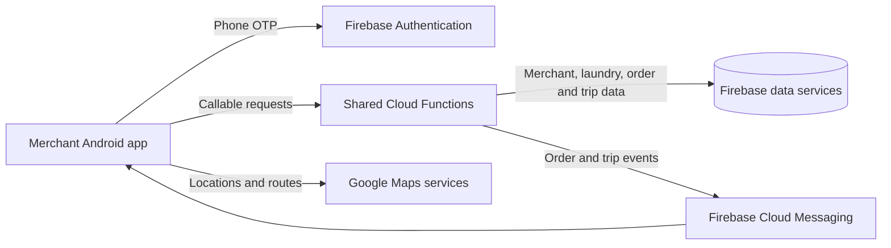

# Laundromat Merchant

The merchant Android app for **Laundromat**, my 2021 BSc Software Engineering final-year project at the International Islamic University Islamabad. Laundry owners can register a home-based or shop-based service, publish a menu, handle customer orders, and arrange pickup and return delivery.

## What the merchant app does

| Area | Client behavior |
| --- | --- |
| Registration and account | Collect merchant identity, contact and payment details, identity image, and laundry information; verify the phone number with Firebase OTP; submit a registration request; log in, recover a password, edit profiles, and log out. |
| Laundry profile | Show or edit the laundry logo, opening hours, discount, and location; switch the laundry's availability on or off. |
| Service catalog | Create, edit, search, and delete menu categories and items. Each item has an image, selected service types, and a price for each service. |
| Orders | Review incoming requests, accept or decline them, view current and past orders, contact customers, cancel eligible orders, and mark cleaning as in service or washed. |
| Delivery | Request a driver for collection after accepting an order and for return delivery after washing. View trip fare and route information, driver details, reported live location, and handover screens. |
| Business overview | View order and product counts, earnings, and a transaction list with earned and spent totals. Receive order and trip updates through Firebase Cloud Messaging. |

## Merchant workflow

1. Enter merchant details and register a laundry with its name, logo, location, type, and opening hours. Submit the registration request for administrator review.
2. Sign in, set the laundry's availability, and build a catalog of items with services and prices.
3. Review an incoming order request and accept or decline it.
4. For an accepted order, request a pickup trip. Follow the driver and confirm collection when the items arrive at the laundry.
5. Mark the order `IN_SERVICE` and then `WASHED`. Request a return delivery trip and follow it through completion.

Order states represented in the app include `REQUESTED`, `ACCEPTED`, `PICKUP_REQUESTED`, `COLLECTED`, `IN_SERVICE`, `WASHED`, `DELIVERY_REQUESTED`, `DELIVERING`, `COMPLETED`, `CANCELLED`, and `DECLINED`. Pickup and return delivery are separate `TripType` values.

## How it is built

- **Platform:** native Android with Java 8 language features, XML layouts, and Material Components.
- **Build:** Gradle 6.7.1 wrapper, Android Gradle Plugin 4.2.2, API 30 for compile/target, and API 23 (Android 6.0) as the minimum.
- **Backend:** Firebase Authentication for phone verification, callable Cloud Functions for merchant and laundry operations, Firebase Cloud Messaging for order and trip events, and Firebase libraries for Firestore and Storage.
- **Maps and media:** Google Maps, Places and location services, an image picker for merchant and catalog images, and Picasso for image display.

The Android client calls functions including `merchant-createNewMerchant`, `admin-getServiceTypes`, `laundry-addMenuItem`, `laundry-setAvailability`, `order_task-acceptOrderRequest`, `order_task-changeOrderStatus`, and `order_task-sendPickupRequest`. The shared application backend is in the [Cloud Functions repository](https://github.com/taymoor-ghazanfar/laundromat-cloud-functions).



Java models hold merchant, laundry, menu, order, trip, and transaction data. Activities and fragments render each workflow, while adapters manage catalog and order lists. The messaging service handles order and trip events; the order screen fetches driver location through a callable function and draws the route on a map. The dashboard calculates counts and earnings from the merchant data returned by the backend.

### Repository layout

```text
app/
  build.gradle                  Android app configuration and dependencies
  src/main/AndroidManifest.xml  Activities, permissions, and messaging service
  src/main/java/com/laundromat/merchant/
    activities/                Dashboard, menu, order, trip, and account screens
    dialogs/, fragments/       Registration, profile, catalog, and order UI
    model/                     Merchant, laundry, item, order, trip, and transaction models
    prefs/                     Local session preferences
    services/                  Firebase messaging and notifications
    ui/                        Adapters, view holders, and custom views
    utils/, helpers/           Validation, parsing, location, and route helpers
  src/main/res/                Layouts, strings, themes, icons, and images
functions/                     Small Firebase function for retrieving a configured Google API key
public/                        Firebase Hosting files
firebase.json                  Firebase Hosting, Firestore, and Storage configuration
gradle/wrapper/                Gradle wrapper
```

The `functions/` folder contains a `getGoogleApiKey` callable function. The merchant, laundry, order, and trip functions used by the Android app are maintained in the separate shared backend repository linked above.

## Build and run

### Prerequisites

- Android Studio with Android SDK and Build Tools for API 30.
- A JDK compatible with the included Gradle 6.7.1 and Android Gradle Plugin 4.2.2 configuration.
- An Android device or emulator running Android 6.0 (API 23) or later with Google Play services.
- A Firebase project with phone sign-in, Firebase Cloud Messaging, and the matching callable functions. Configure Google Maps and Places APIs for that project.

1. Clone this repository and open its root directory in Android Studio.
2. Supply Firebase Android configuration for application ID `com.laundromat.merchant` at `app/google-services.json`.
3. Configure `google_maps_api_key` and `google_api_key` in `app/src/main/res/values/strings.xml` for Maps, routes, and Places.
4. Deploy the shared backend functions and configure the service types and trip-fare settings used by the merchant screens. Registration also relies on the administrator workflow.
5. Select the app run configuration in Android Studio, or run `./gradlew :app:assembleDebug` (`.\gradlew.bat :app:assembleDebug` on Windows). Install the debug APK on a device or emulator.

The manifest requests internet, location, camera, and external-storage access for registration, maps, and image selection.

## Related repositories

- [Customer app](https://github.com/taymoor-ghazanfar/laundromat-customer) — laundry discovery, booking, and order tracking.
- [Merchant app](https://github.com/taymoor-ghazanfar/laundromat-merchant) — catalog and order management (this repository).
- [Delivery app](https://github.com/taymoor-ghazanfar/laundromat-delivery) — trip requests, navigation, and handovers.
- [Admin app](https://github.com/taymoor-ghazanfar/laundromat-admin) — approvals and system administration.
- [Cloud Functions](https://github.com/taymoor-ghazanfar/laundromat-cloud-functions) — shared backend operations and notifications.

## Academic context and license

Developed by **Taymoor Ghazanfar**, supervised by **Dr. Muhammad Nadeem**, International Islamic University Islamabad (2021).

The repository includes an [Apache License 2.0](LICENSE) file.
